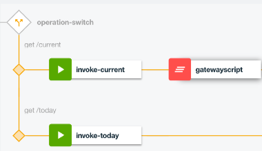

# 3. Write JavaScript to enrich API payloads

**Authors** 
* [Ozair Sheikh](https://github.com/ozairs)

**Prerequisites**
* [API Connect Developer Toolkit 5.0.7.1](https://www.ibm.com/support/knowledgecenter/SSMNED_5.0.0/com.ibm.apic.toolkit.doc/tapim_cli_install.html)

In this tutorial, you will learn how to modify the API payload / headers using JavaScript by configuring a GatewayScript policy.

**Instructions:** 

* **Note**: If you did not complete previous tutorial, import the API definitions file from **https://raw.githubusercontent.com/ozairs/apiconnect/master/gatewayscript/weather-provider-api_1.0.0.yaml**. See instructions [here](https://www.ibm.com/support/knowledgecenter/SSMNED_5.0.0/com.ibm.apic.apionprem.doc/create_api_swagger.html)

1. Drag the The GatewayScript policy after the **invoke-current** policy (ie `get /current`). 
	
2. Insert the following code into the editor. It will obtain the runtime API context (ie payload + header + protocol info). Copy/paste the code below:

	```
	//get the runtime API context
	var json = apim.getvariable('message');
	console.info("json %s", JSON.stringify(json));
	
	//add a new attribute to the payload body
	json.body.platform = 'Powered by IBM API Connect';

	//set the runtime API context
	apim.setvariable('message.body', json.body);
	```

	The `message` context variable is the default context that contains the API runtime context, which includes the JSON body sent back to the consumer. 
3. Click on the X to close the editor menu and save your changes.
4. Test the Weather API. Click the **Play icon** to open the built-in test tool. Test the **get /current** operation, enter **zipcode** value of `90201`. The response is returned with the additional attribute `platform` containing `Powered by API Connect`.
	```
	{
		"zip": "90210",
		"temperature": 61,
		"humidity": 93,
		"city": "Beverly Hills",
		"state": "California",
		"platform": "Powered by IBM API Connect"
	}
	```
	**Important**
	Context variables in the API assembly provide API transaction information:
	* **request**: pre-built context variable provides the original request message
	* **message**: pre-built context variable provides access to the current message in the assembly
	* **custom**: context variables *created* during the API assembly with unique names and used in subsequent actions, such as GatewayScript.

	Each context variable has additional attributes such as `body`, `headers`, etc ... that provide additional runtime context.

5. Inject an HTTP response header in the same GatewayScript policy. Replace the existing code with the following:
	```
	//get the runtime API context
	var json = apim.getvariable('message');
	console.error("json %s", JSON.stringify(json.headers));
	
	//add a new attribute to the payload body 
	json.body.platform = 'Powered by IBM API Connect';
	apim.setvariable('message.body', json.body);

	//add a new response header
	json.headers.platform = 'Powered by IBM API Connect';
	apim.setvariable('message.headers', json.headers);
	```
6. The built-in test editor does not show custom headers, so you will need to issue a curl command to verify that a new response header is returned.
	```
	 curl https://127.0.0.1:4001/current?zipcode=90210 -H "X-IBM-Client-Id: default" -k -v
	```
	
For more information about writing JavaScript, see [here](https://www.ibm.com/support/knowledgecenter/SSMNED_5.0.0/com.ibm.apic.toolkit.doc/rapim_gwscript_codesnip.html).

The API Connect assembly code is great but what happens when the service is unavailable or provides an unexpected response. In the [next](../master/error-handling/README.md) tutorial, you will learn how to throw and catch errors.

**API Integration with XML-based services**

These tutorials are focued on REST/JSON workloads. If your consumer / backend is using XML, several policies are available for interacting with json and xml. 
* Map: provides schema to schema transformation
* xslt: transforms xml documents using XSLT stylesheets
* xml-to-json and json-to-xml: auto-generate XML and JSON payloads dynamically

Once the message is transformed, you could use a `Validate` action to verify the message.

For more information on these policies, view the docs [here](https://www.ibm.com/support/knowledgecenter/SSMNED_5.0.0/com.ibm.apic.toolkit.doc/rapim_ref_ootb_policies.html).

In this tutorial, you learned how to modify JSON payload and HTTP headers using JavaScript via the GatewayScript policy.

**Next Tutorial**: [Handling API Errors](../master/error-handling/README.md)